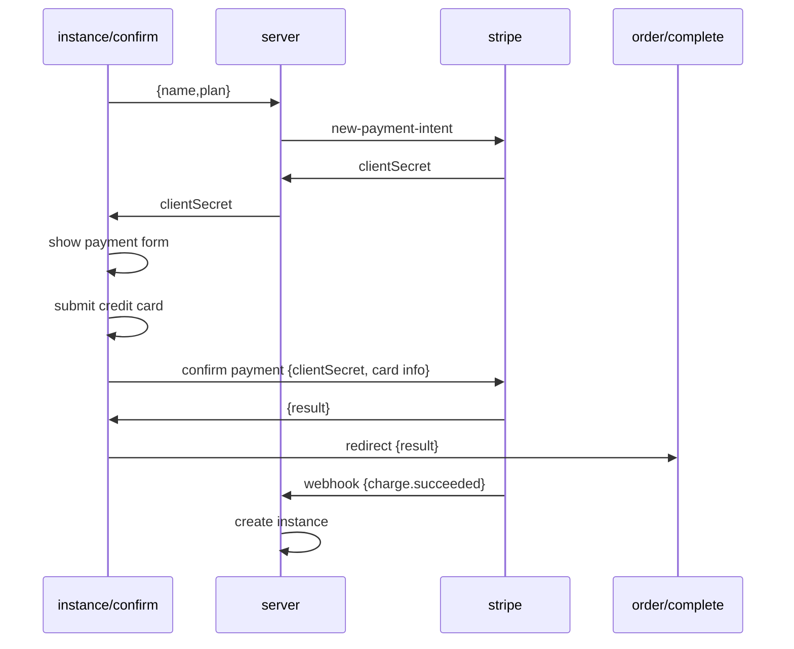

# Creating an Instance

```mermaid
sequenceDiagram
    instance/confirm->>server: {name,plan}
    server->>stripe: new-payment-intent
    stripe->>server: clientSecret
    server->>instance/confirm: clientSecret
    instance/confirm->>instance/confirm: show payment form
    instance/confirm->>instance/confirm: submit credit card
    instance/confirm->>stripe: confirm payment {clientSecret, card info}
    stripe->>instance/confirm: {result}
    instance/confirm->>order/complete: redirect {result}
    stripe->>server: webhook {charge.succeeded}
    server->>server: create instance    
```
